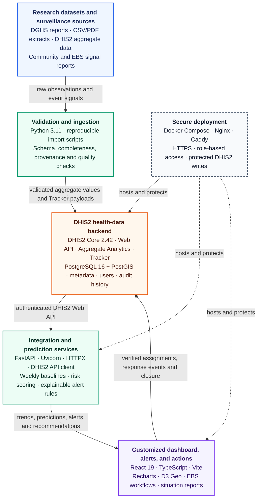

# OneHealth Intelligence Platform

[](https://github.com/khalilurrrahmanridoykhan/onehealth-platform/actions/workflows/ci.yml)
[](https://www.python.org/)
[](https://fastapi.tiangolo.com/)
[](LICENSE)
[](#project-status)

An open-source disease-surveillance, early-warning, and response platform for Bangladesh. The project is being developed incrementally from reproducible dengue, measles, highly pathogenic avian influenza (HPAI), Nipah, Japanese encephalitis (JE), acute watery diarrhoea, and human rabies research workflows.

Created and maintained by **Khalilur Rahman Ridoy Khan** ([khalilurrrahmanridoykhan](https://github.com/khalilurrrahmanridoykhan)).

> [!IMPORTANT]
> This repository is an early practice and research implementation. It is not a validated clinical tool, an official outbreak-definition system, or a production DHIS2 deployment.

## Vision

The target platform combines a customized public-health dashboard with DHIS2 as the health-data backend and independent services for ingestion, prediction, explainable alerts, and response recommendations.

### Technical workflow



The primary path moves validated surveillance data into DHIS2, uses independent services for analysis and decision support, and presents the results through the customized application. Operational updates flow back to DHIS2 Tracker so that assignments, response events, closure, permissions, and audit history remain in the health-data system of record.

The DHIS2 integration foundation, customized frontend, and test-instance deployment are implemented. Formal operational validation remains on the roadmap.

## DHIS2-backed architecture in practice

This project follows an established DHIS2 implementation pattern: DHIS2 acts as the health-data backend and system of record, while a purpose-built web application provides a more flexible user experience and additional decision-support functions.

```text
DHIS2 aggregate data and Tracker records
                    ↓ Web API
       OneHealth integration services
                    ↓
 Customized maps, predictions, alerts,
 comparisons, EBS workflow, and response tools
```

In this architecture, DHIS2 manages organisation units, aggregate surveillance data, Tracker enrollments and events, metadata, users, permissions, and audit history. The customized OneHealth application adds Bangladesh boundary maps, prediction and risk models, explainable alerts, geographic and period comparisons, signal triage, response queues, recommended actions, and a role-specific interface. DHIS2 supports this model through its open Web API and custom application platform; see the official [DHIS2 architecture](https://dhis2.org/architecture/) and [application platform](https://dhis2.org/applications/) documentation.

### Similar implementations

| Country/organisation | Programme | How it relates to your project |
|---|---|---|
| Indonesia | National One Health and e-Zoonosis | Uses a customized DHIS2 mobile application for zoonotic case reporting, investigation and logistics planning. |
| Tanzania | Electronic Event-Based Surveillance | Community and government sectors report unusual events, investigate signals and coordinate responses across health, livestock and environmental sectors. |
| Zanzibar | Animal-health and One Health EBS | Community workers, veterinarians and district staff report and verify unusual health events using DHIS2 mobile workflows. |
| Sri Lanka | COVID-19 surveillance | Used DHIS2 Tracker for suspected cases, laboratory results, contact tracing and outcomes. |
| Africa CDC | Event-Based Surveillance | Customized DHIS2 for regional event detection and management, including integration possibilities with WHO EIOS. |
| Burkina Faso | One Health platform | Uses DHIS2 for cross-sector One Health surveillance. |

These examples are described in the official [DHIS2 One Health](https://dhis2.org/one-health/), [disease surveillance](https://dhis2.org/disease-surveillance/), and [COVID-19 surveillance](https://dhis2.org/covid-surveillance/) resources. DHIS2 also documents Tracker and Event use across more than 75 countries for programmes including malaria, tuberculosis, HIV, disease surveillance, and maternal and child health; see [DHIS2 Tracker](https://dhis2.org/tracker/). A detailed reference design for integrated animal and human event-based surveillance is available in the [DHIS2 Animal Health EBS design guide](https://docs.dhis2.org/en/implement/health/animal-health/event-based-surveillance/design.html).

> [!NOTE]
> This repository is an independent demonstration and research implementation for Bangladesh. It must not be represented as an official DGHS or Government of Bangladesh system unless it is formally reviewed, approved, and adopted by the responsible authorities.

## Current capabilities

- Validates an existing daily dengue CSV export
- Aggregates observations into ISO epidemiological weeks
- Produces a normalized surveillance dataset with source provenance
- Includes national and eight-division dengue surveillance
- Includes national and quality-controlled division weekly measles suspected-case surveillance
- Includes national and seven-division HPAI reported-outbreak surveillance across 19 source-reported semesters (2007–2025)
- Includes literature-compiled annual Nipah cases and deaths (2001–2024) and seven-division cumulative hotspot burden (2001–2021)
- Lets users switch disease programmes without leaving the customized dashboard
- Detects partial reporting weeks and excludes them from alert calculations
- Generates explainable alerts using a four-week historical baseline
- Exposes FastAPI endpoints for diseases, trends, and latest alerts
- Previews, validates, submits, and reads DHIS2 aggregate surveillance payloads
- Displays an interactive Bangladesh division risk map
- Includes native DHIS2 Dengue, Measles, HPAI, Nipah, Japanese encephalitis, AWD, and human rabies analytical dashboards
- Previews EBS signal enrollment payloads while DHIS2 writes remain disabled by default
- Includes automated tests and continuous integration

## Project status

| Capability | Status |
|---|---|
| Dengue CSV ingestion | Implemented |
| Weekly surveillance data model | Implemented |
| Explainable baseline alerts | Implemented |
| FastAPI service | Implemented |
| DHIS2 API client and mapping foundation | Implemented |
| DHIS2 metadata and data-value dry-run synchronization | Implemented |
| Division-level dengue surveillance | Implemented |
| Live DHIS2 instance validation | Implemented on the project test instance |
| Customized React surveillance dashboard | Implemented with division map and EBS preview workspace |
| EBS Tracker metadata and payload workflow | Implemented; live validation pending |
| Measles integration | Implemented nationally and for five divisions with complete weekly source coverage |
| Native DHIS2 Measles dashboard | Implemented with KPIs, trends, division comparisons, table, and thematic map |
| HPAI / WAHIS integration | Implemented with sparse national and division semester records; reporting gaps remain missing, not zero |
| Native DHIS2 HPAI dashboard | Implemented with outbreak KPIs, trend, comparison, table, and thematic map |
| Japanese encephalitis sentinel surveillance | Implemented from Paul et al. (2020): 548 confirmed cases across four hospital sentinel sites, 2007–2016; 2016 is partial through July |
| Native DHIS2 JE dashboard | Implemented with historical KPIs, annual trend, sentinel-site comparison, cumulative burden, and table; no district choropleth is claimed |
| AWD ecological-estimate integration | Implemented for 2014–2024 with national sums and all eight divisions; values are literature-derived estimates, not authenticated live EWARS observations |
| Native DHIS2 AWD dashboard | Implemented with estimated-case KPIs, annual trend, division comparison, table, and explicitly labelled thematic map |
| Human rabies mortality integration | Implemented from WHO GHO indicator NTD_RAB2 with ten national annual reported-death records, 2015–2024 |
| Native DHIS2 rabies dashboard | Implemented with mortality KPIs, full trend, post-2020 view, and annual table; no subnational map is fabricated |
| Nipah literature integration | Implemented with national annual cases/deaths and division cumulative burden |
| Native DHIS2 Nipah dashboard | Implemented with cases/deaths KPIs, historical trend, hotspot comparison, table, and map |
| AWD/environmental-risk integration | Planned |
| Operational validation | Not started |

See the [roadmap](#roadmap) and [architecture documentation](docs/ARCHITECTURE.md) for the intended progression.

## Quick start

### Requirements

- Python 3.11 or newer
- Git

### Installation

```bash
git clone https://github.com/khalilurrrahmanridoykhan/onehealth-platform.git
cd onehealth-platform
python3 -m venv .venv
source .venv/bin/activate
python -m pip install -e '.[dev]'
```

On Windows PowerShell, activate the environment with `.venv\Scripts\Activate.ps1`.

### Import dengue data

```bash
python scripts/import_dengue.py /path/to/dengue_daily_2026.csv
```

The importer expects:

```csv
date,dengue_cases_daily
2026-01-01,76
2026-01-02,63
```

Normalized output is written to `data/processed/dengue_weekly.csv`. Boundary weeks are retained for transparency, while incomplete weeks are excluded from alerts.

### Import measles data

```bash
python scripts/import_measles.py /path/to/measles_national_summary.csv \
  --division-source /path/to/measles_division_breakdown.csv
```

The importer reads aggregate DGHS daily suspected-case fields, groups them into Monday–Sunday ISO weeks, and writes `data/processed/measles_weekly.csv`. It rejects PDF-parser contamination when a purported division value exceeds its corresponding national daily total. Partial weeks remain visible for audit but are excluded from DHIS2 synchronization and alert calculations. The current source provides complete weekly coverage for Dhaka, Chattogram, Khulna, Rajshahi, and Rangpur; unavailable divisions remain explicitly unreported rather than being estimated.

### Import HPAI data

```bash
python scripts/import_hpai.py /path/to/hpai_modeling_dataset.csv
```

The importer converts the public WOAH WAHIS division-semester quantitative export into `data/processed/hpai_semester.csv`, combines poultry/wildlife rows for the same place and semester, maps the Narayanganj Sadar record to Dhaka Division, and adds an auditable national sum. Semesters absent from the WAHIS export remain **missing**, not zero. The source uses the historical seven-division geography, where Mymensingh is included within Dhaka; the platform therefore leaves Mymensingh unreported instead of inventing a separate value. The normalized field named `cases` is a common internal measure slot; in the HPAI interface it is correctly presented as **reported outbreaks**.

### Import Japanese encephalitis data

```bash
PYTHONPATH=src python scripts/import_je.py \
  /path/to/je_cases_by_site_year.csv
python scripts/build_je_dashboard.py
```

The JE integration uses the exact year-by-site table transcribed from Paul et al. (2020). It creates a national annual series and four sentinel-hospital series mapped to Rangpur, Rajshahi, Chattogram, and Khulna divisions. These are **sentinel-site counts**, not population-wide division incidence. Blank site-years remain missing. The 2016 value covers January through July only and is labelled partial in the normalized source data and native dashboard. No district map, mortality series, real-time forecast, or alert is inferred from unavailable data.

### Import acute watery diarrhoea estimates

```bash
PYTHONPATH=src python scripts/import_awd.py /path/to/awd_annual_paper_sourced.csv
python scripts/build_awd_dashboard.py
```

The AWD importer preserves the eight annual division estimates and computes an auditable national sum for each year. These values are derived from published national totals and proxy division weights described by the source research project. They must not be presented as direct division-level DHIS2/EWARS observations. The platform therefore labels the metric as **estimated AWD cases** and disables operational prediction alerts.

### Import human rabies mortality

```bash
PYTHONPATH=src python scripts/import_rabies.py /path/to/rabies_deaths_rate_bgd.csv
python scripts/build_rabies_dashboard.py
```

The rabies programme stores WHO GHO indicator NTD_RAB2 as annual **reported human rabies deaths**. Public data provide national resolution only, so the custom dashboard substitutes a national evidence-coverage panel for the division map, and the native dashboard does not claim a subnational visualization. Automated outbreak alerts are disabled for this retrospective annual series.

### Import Nipah data

```bash
python scripts/import_nipah.py /path/to/nipah_national_annual.csv \
  /path/to/nipah_division_summary.csv
```

The Nipah integration is explicitly a **historical literature compilation**, not a live surveillance feed. National annual cases and deaths for 2001–2024 are stored separately in DHIS2; division values are cumulative affected-district totals for 2001–2021 and are stored at period 2021 for analytical mapping. The custom application disables rolling alerts and predictions for this programme because applying a real-time warning model to retrospective annual literature data would be misleading. Cite Satter et al. (2023), [PLOS Neglected Tropical Diseases](https://doi.org/10.1371/journal.pntd.0011617), and Bhowmik et al. (2024), *Science in One Health*, when reusing the underlying values.

### Reproduce the current output

Install the project, regenerate the normalized dengue dataset from the committed aggregate source snapshot, and run all tests with one command:

```bash
make reproduce
```

### Start the API

```bash
uvicorn onehealth.api:app --reload
```

- API: <http://127.0.0.1:8000>
- Interactive documentation: <http://127.0.0.1:8000/docs>
- OpenAPI schema: <http://127.0.0.1:8000/openapi.json>

The default backend is the committed CSV demonstration. To read from a configured DHIS2 instance, follow the [DHIS2 integration guide](docs/DHIS2_INTEGRATION.md) and set `ONEHEALTH_BACKEND=dhis2`.

The six-stage Event-Based Surveillance program is documented in the [EBS Tracker guide](docs/EBS_TRACKER.md).

### Start the customized dashboard

In a second terminal:

```bash
cd frontend
npm ci
npm run dev
```

Open <http://127.0.0.1:5173>. The Vite development server proxies API requests to FastAPI on port `8000`.

The current dashboard includes:

- Bangladesh and division location selection
- Latest, expected, percentage-change, and cumulative summary cards
- Weekly dengue epidemic curve
- Explainable risk status and recommended actions
- National and division comparison table
- Interactive division risk map linked to location selection
- Six-stage EBS workflow with safe detection and follow-up event previews
- Protected DHIS2 signal registry with search, detail, and event history
- Operational alert queue with officer assignment written to DHIS2 Tracker
- Due-date monitoring with due-soon, due-today, overdue, and unassigned states
- In-application operational notifications and downloadable CSV situation reports
- Idempotent, non-identifiable EBS demonstration scenarios covering every queue state
- Signed application sessions and Viewer/Analyst/Responder/Admin roles
- Non-root container deployment baseline with automatic HTTPS
- Responsive desktop and mobile layouts

### Available endpoints

| Method | Endpoint | Purpose |
|---|---|---|
| `GET` | `/health` | Service health and version |
| `GET` | `/api/v1/diseases` | Available diseases |
| `GET` | `/api/v1/locations?disease_code=DENGUE` | Available national and division locations |
| `GET` | `/api/v1/trends/DENGUE` | Complete weekly dengue records |
| `GET` | `/api/v1/trends/MEASLES?location_code=BD` | Complete national weekly measles records |
| `GET` | `/api/v1/trends/HPAI?location_code=BD` | National six-monthly HPAI outbreak records |
| `GET` | `/api/v1/trends/NIPAH?location_code=BD` | National annual Nipah cases and deaths |
| `GET` | `/api/v1/trends/JE?location_code=BD` | Historical national annual JE confirmed cases |
| `GET` | `/api/v1/trends/AWD?location_code=BD` | National annual literature-derived AWD estimates |
| `GET` | `/api/v1/trends/RABIES?location_code=BD` | WHO GHO national annual reported human rabies deaths |
| `GET` | `/api/v1/trends/DENGUE?location_code=BD-DHA` | Dhaka Division weekly trend |
| `GET` | `/api/v1/trends/DENGUE?complete_only=false&limit=10` | Include partial weeks and limit results |
| `GET` | `/api/v1/alerts/DENGUE/latest` | Latest explainable dengue alert |
| `GET` | `/api/v1/alerts/DENGUE/latest?location_code=BD-DHA` | Latest Dhaka Division alert |
| `GET` | `/api/v1/summary/DENGUE?location_code=BD-DHA` | Summary metrics for a location |
| `GET` | `/api/v1/ebs/schema` | EBS program-stage schema for the custom UI |
| `GET` | `/api/v1/ebs/status` | Non-secret DHIS2 registry readiness and safety status |
| `GET` | `/api/v1/ebs/signals` | Search saved Tracker signals when protected reads are enabled |
| `GET` | `/api/v1/ebs/signals/{uid}` | Read a saved signal and mapped event timeline |
| `GET` | `/api/v1/ebs/operations` | Read and filter the operational response queue |
| `POST` | `/api/v1/ebs/operations/{uid}/assignment` | Assign an officer, deadline, actions, and response status |
| `GET` | `/api/v1/ebs/notifications` | Generate actionable deadline and ownership notifications |
| `GET` | `/api/v1/ebs/reports/situation.csv` | Download the current protected situation report |
| `POST` | `/api/v1/ebs/signals/preview` | Validate and preview a DHIS2 Tracker signal payload |
| `POST` | `/api/v1/ebs/signals` | Submit a signal only when EBS writes are explicitly enabled |
| `POST` | `/api/v1/ebs/stages/preview` | Validate and preview a follow-up Tracker stage event |
| `POST` | `/api/v1/ebs/stages` | Submit a follow-up event only when EBS writes are explicitly enabled |

## Alert interpretation

The practice algorithm compares the latest complete week with the mean of the previous four complete weeks.

| Current cases compared with baseline | Risk |
|---|---|
| Less than 120% | Low |
| 120% to less than 150% | Medium |
| 150% or more | High |

The result includes the observed and expected case counts, risk level, confidence heuristic, reasons, and recommended follow-up actions. These thresholds must be calibrated and validated before operational use.

## Testing

```bash
pytest
```

CI runs the test suite on supported Python versions for every push and pull request.

## Repository structure

```text
onehealth-platform/
├── .github/                  Community templates and CI
├── data/processed/           Normalized demonstration output
├── data/raw/                 Public aggregate source snapshot
├── docs/                     Architecture and data documentation
├── frontend/                 Customized React/TypeScript dashboard
├── scripts/                  Command-line ingestion tools
├── src/onehealth/            Application package
│   ├── api.py                FastAPI routes
│   ├── models.py             Domain models
│   └── services/             Ingestion, surveillance, and alerts
└── tests/                    Automated tests
```

## Data provenance and privacy

The included demonstration dataset is derived from publicly accessible, aggregate DGHS Bangladesh dengue reporting. It contains no names, patient identifiers, or individual-level health records. Every normalized record retains its source name and URL.

- Source: DGHS HEOC Dengue Dynamic Dashboard
- Source URL: <https://dashboard.dghs.gov.bd/pages/heoc_dengue_v1.php>
- Geographic scope: Bangladesh, national aggregate
- Temporal scope in the committed daily snapshot: 1 January–3 June 2026
- Data unit: daily admitted dengue cases
- Accessed by the upstream research project: June 2026
- Transformation: validated daily counts aggregated into Monday–Sunday ISO weeks
- Missing-value convention: empty normalized cells mean unavailable or not applicable

The committed measles series is also public, aggregate DGHS reporting and contains no patient identifiers.

- Source: DGHS Bangladesh measles national situation summaries
- Geographic scope: Bangladesh national aggregate plus source-available division observations
- Temporal scope: 2 April–2 June 2026
- Data unit: daily suspected measles cases reported in the previous 24 hours
- Transformation: daily counts aggregated into Monday–Sunday ISO weeks
- Quality rule: division rows exceeding the corresponding national daily value are rejected as parser contamination
- Completeness rule: only weeks containing all seven daily reports are synchronized to DHIS2 and used in trends and alerts

See the [data dictionary](docs/DATA_DICTIONARY.md) for variables, types, units, allowed values, and missing-value rules. See the [ethics statement](docs/ETHICS.md) for the current review basis and requirements for future operational data.

Do not commit credentials, protected health information, or identifiable patient data. See [SECURITY.md](SECURITY.md) for responsible reporting.

## Roadmap

1. Validate national and division metadata synchronization against a live DHIS2 instance.
2. Validate the EBS Tracker metadata and signal workflow against the live instance.
3. Validate EBS signal submission with controlled test data on the live instance.
4. Deploy the baseline to a controlled HTTPS test environment.
5. Validate DHIS2 metadata, reads, previews, and guarded writes on the test instance.
6. Add external identity-provider integration for production environments.
7. Extend Measles coverage to the remaining divisions and districts when complete authoritative series are available.
8. Integrate AWD, rainfall, and flood-risk indicators.
9. Validate alert methods with public-health experts before operational use.

## Contributing

Contributions, reproducibility checks, documentation improvements, and public-health feedback are welcome. Read [CONTRIBUTING.md](CONTRIBUTING.md) and the [Code of Conduct](CODE_OF_CONDUCT.md) before opening a pull request.

## Citation

If you use this software in research, cite the repository using [CITATION.cff](CITATION.cff). A versioned DOI can be added to the citation metadata when an archival release is available.

## License

Licensed under the [MIT License](LICENSE). Third-party datasets remain subject to their original terms and attribution requirements.
